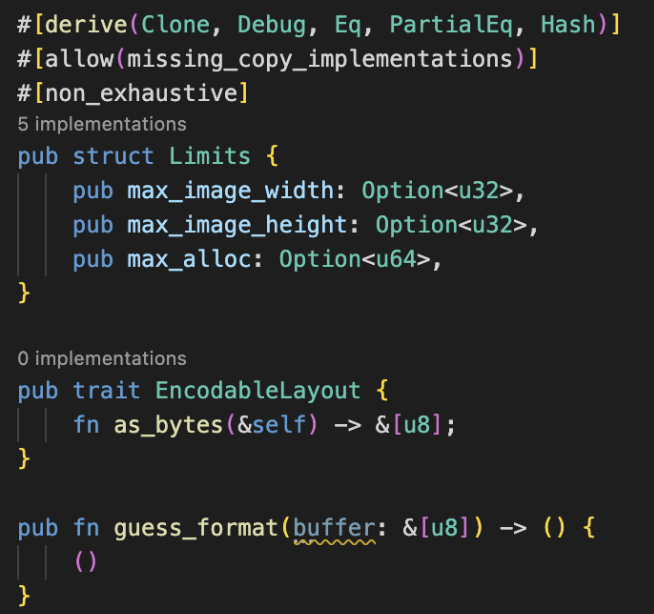
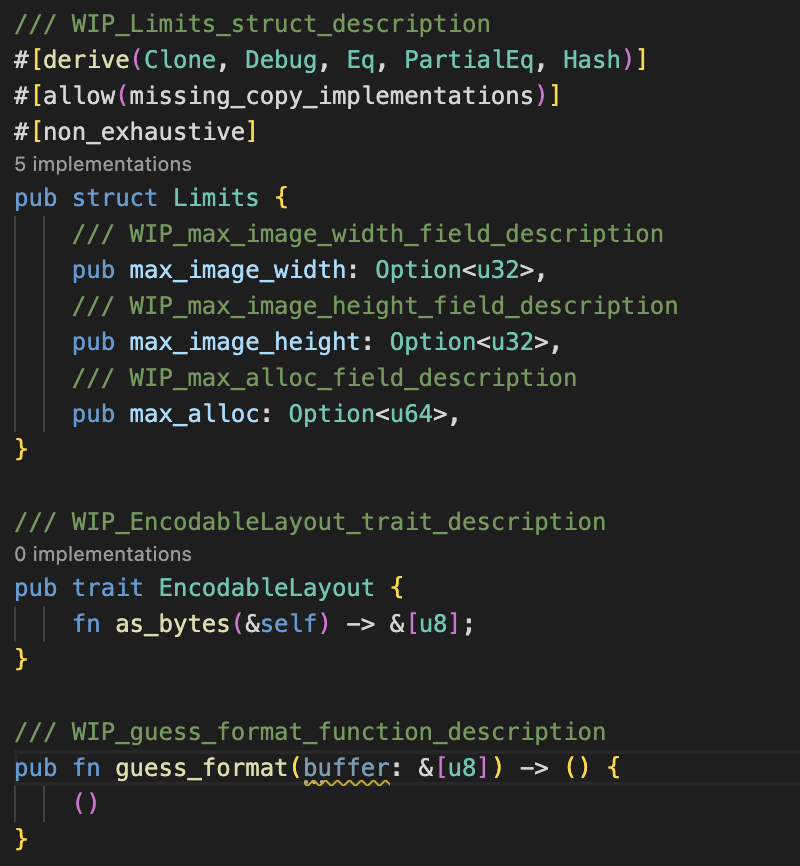

# gen_docs_template

> **This CLI automatically creates templates of comment text required when generating docs.rs!!(docs.rs の生成時に必要なコメント文のテンプレートを自動作成する CLI です!!)**

# How to use

## install

Run the following command:

```
cargo install gen_docs_template
```

<div style="display: flex; gap: 10px;">
    <figure style="width: 300px; text-align: center; margin: 0;">
        
        <figcaption>Before</figcaption>
    </figure>
    <figure style="width: 300px; text-align: center; margin: 0;">
        
        <figcaption>After</figcaption>
    </figure>
</div>

[Crates.io](https://crates.io/crates/gen_docs_template)

[Documentation](https://docs.rs/typo_checker/0.0.3/gen_docs_template/)
