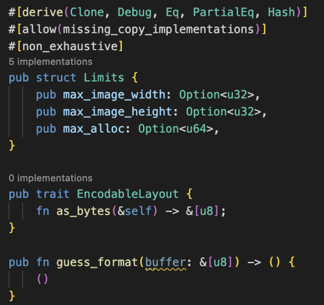

# gen_docs_template

> **This CLI automatically creates templates of comment text required when generating docs.rs!!(docs.rs の生成時に必要なコメント文のテンプレートを自動作成する CLI です!!)**

# How to use

## install

Run the following command:

```
cargo install gen_docs_template
```

## run

It generates docs.rs template comments for all files in src.

```
gen_docs_template
```

| Before                                         | After                                         |
| ---------------------------------------------- | --------------------------------------------- |
|  |  |

[Crates.io](https://crates.io/crates/gen_docs_template)

[Documentation](https://docs.rs/typo_checker/0.0.5/gen_docs_template/)
